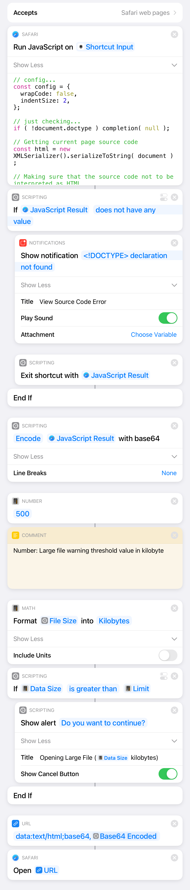

# View Source Code

Blog article about this (Japanese only)

[iPadやiPhoneのSafariでWebページのソースコードを見る方法 | The Strange Storage](https://www.storange.jp/2021/02/view-source-code-shortcuts.html)

## What is this?

This is a shortcut for iOS/iPadOS that allows you to view the source code of the webpage your browsing on Safari. The source codes are cleanly highlighted and beautified using “Prism.js” and “js-beautify”.

## What's this repo for?

The JavaScript file named 'source_viewer_gen.js' is a part of "View Source Code" shortcut for iOS/iPadOS. If you don't want to download this shortcut from iCloud link below for security purpose, you can re-create this shortcut using this JS file and the screenshot of this shortcut's logic.

## See Demo

You can see the demo at YouTube.
https://www.youtube.com/watch?v=jw3e7meJi9g

## Download

Download "View Source Code" shortcut via iCloud link.
https://www.icloud.com/shortcuts/748cd990e98843879adb91a63f410ed5

## Screenshot

## License

This source-code is released under the MIT License, see "LICENSE" file.
